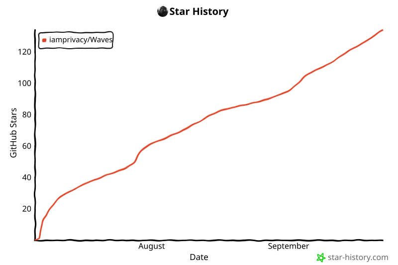

<p align="center">
  
</p>

<p align="center">
  <strong>A native desktop app for saving music from your own TIDAL account for offline listening: search‑first, art‑forward, and built for people who'd rather click than type.</strong>
</p>

<!-- The badges live on ONE source line on purpose: GitHub joins the split
     lines into a row, but other renderers (the mirror frontends among them)
     treat each source line as its own line and stack the badges vertically. -->
<p align="center">
  <a href="LICENSE"></a> <a href="#install"></a> <a href="#install"></a>
</p>

<p align="center">
  
  <br>
  <em>Browse new arrivals and save any track for offline listening in one click.</em>
</p>

<p align="center">
  
  <br>
  <em>Search anything, preview an artist in place, and save a whole discography for offline listening.</em>
</p>

Waves is a from‑scratch, native desktop app for macOS, Windows, and Linux (Intel/AMD and Apple‑silicon/ARM). Its download engine descends from the proven Tidal‑DL‑NG project (continued by the community as [**Tidaler**](https://github.com/maya-doshi/tidaler)) and is maintained and improved here; see [Standing on the shoulders of others](#standing-on-the-shoulders-of-others) for the full lineage.

> A paid TIDAL plan is required. Waves saves from **your own** account, for your personal, non‑commercial use, and can only save what your account can play, up to HiRes Lossless / TIDAL MAX (24‑bit, 192 kHz) and Dolby Atmos where available.

## What Waves can do

- Search all of TIDAL from a single bar, or paste a link to open a release instantly.
- Browse artist and album pages rich with cover art, quality badges, and dates you can sort and filter.
- Preview a full track (or an artist's top song) right inside the app before you save it.
- Save a track, an album, a playlist, a mix, a music video, or an artist's whole discography for offline listening, in one click.
- Pick exactly what a discography pulls in, and let Waves skip duplicate editions.
- Keep your TIDAL favorites close, however large your library grows.
- Follow everything in flight in a live, grouped queue that says what each one will actually sound like.
- Point Waves at your existing music library and see what you already own, badged right in the search results (new, experimental).
- Write Plex‑friendly tags (ReplayGain volume leveling included), and choose the explicit or clean version.
- Set up FFmpeg with one click, and optionally update Waves from inside the app.
- Run native on macOS, Windows, and Linux, at quality up to HiRes Lossless and Dolby Atmos.

---

## Standing on the shoulders of others

Waves exists because of a chain of people who built and kept alive a tool a lot of us love. None of this is mine alone, and I want that to be the first thing you read, not a footnote.

- **exislow** created Tidal‑DL‑NG, the project everything here descends from. The original repository and account disappeared from GitHub, and as far as I know exislow never returned. The work was, and is, excellent. Thank you.
- After that, members of the community picked it up and kept it running. Some of those forks were taken down too, or wound down over time. Everyone who spent their own hours keeping this alive has my gratitude.
- Today it lives on as **[Tidaler](https://github.com/maya-doshi/tidaler)**, maintained by **[maya-doshi](https://github.com/maya-doshi/)** in their spare time. Waves began as a front end built directly on Tidaler, and its engine descends from Tidaler's (more on that below). Thank you, maya‑doshi, for keeping the lights on.
- And underneath all of it sits **[tidalapi](https://github.com/tamland/python-tidal)**, the Python TIDAL client the rest of the stack is built on. It's the layer at the very bottom: every search, every login, and every track that arrives happens because tidalapi is quietly speaking to TIDAL on Waves' behalf. Tidal‑DL‑NG began by wrapping it, and Tidaler and Waves rest on it still; none of them could exist without it. Most people will never see it, which is the sign of a good foundation. Thank you to everyone who has built and maintained it.

I'm a sucker for a beautiful graphical interface and tend to avoid the command line, but I seem to be in the minority, so the GUI side of tools like Tidaler doesn't get as much attention as the engine underneath. Waves is my way of giving back in a way that's genuinely useful (and, honestly, scratches my own itch): a polished, native GUI that doesn't touch what already works so well.

**Waves is, and always will be, open source under the same license as Tidal‑DL‑NG and Tidaler** (see [License](#license)).

---

## A new face, and an engine kept sharp

The single most important design rule of Waves: **don't break what works, but never stop improving what can be.** Both halves carry equal weight. The parts that already earned their keep in Tidal‑DL‑NG (and live on in Tidaler), TIDAL authentication, the multithreaded / multi‑chunk transfer engine, metadata tagging, quality handling, and configuration, descend from that upstream code, used as‑is wherever it still does its job well. The other half is just as deliberate: where that same code hit a real limit (a slow write to a network drive, a handshake storm pegging the CPU, a file that could be left half‑written), Waves improves it in place rather than leaving it be. Nothing is rewritten for its own sake, and nothing that meets a genuine problem is left untouched just because it came from upstream.

Concretely, Waves is a self‑contained UI package (`waves/waves_ui/`) that _imports_ the engine's objects (`Settings`, `Tidal`, `Download`, search) and presents them through a Qt Quick interface. The engine code descends from the upstream Tidaler code, kept intact apart from **a handful of small, surgical changes**: a six‑line tweak so an in‑progress segment can be aborted mid‑chunk (Waves stops/quits instantly instead of waiting on a network read); an optional `keep_album` flag on the per‑track download so the "best of both" edition merge can tag a borrowed track under a chosen edition, together with writing that file's item id as the edition it was filed under rather than the one it streamed from, so a later save recognizes Waves' own file instead of writing a duplicate beside it; a hardened final move that swaps each finished file into place atomically, so an interrupted download can never leave a half‑written file in your library; pooled, reused connections so track segments stop paying a fresh encrypted handshake each (the fix for downloads pegging the CPU); a post‑download container repair so segmented tracks report their real length in strict players; large batched writes with retry, so a network drive sees a few big writes per track instead of hundreds of tiny ones; a rate‑limit pause that does what its settings say (after every N songs, for the set number of seconds), so a long run paces itself instead of asking TIDAL for too much at once; a playlist run that finishes what it can, skipping and counting a song TIDAL has taken down, waiting out a slow‑down request instead of failing the song, and carrying on past one song that goes wrong so the rest still arrive; and some defensive security hardening. Everything else is used as‑is.

To be just as plain about what is new: it's mine. I wrote the interface, the in-app updater, the managed ffmpeg install, and the packaging that ships it all as a signed desktop app, and that comes to about two thirds of the code in this repository. The rest is the engine that Tidal-DL-NG built and Tidaler carried forward, now maintained here, with the surgical improvements described above.

---

## What's new in Waves

Everything below is **new in Waves**, layered on top of the Tidal‑DL‑NG engine described above:

- **A from‑scratch native UI**: a calm, dark "console" theme (CRT phosphor‑green) drawn in PySide6 / Qt Quick. No web view, no Electron; one real desktop window.
- **Browse, where Waves opens**: TIDAL's editorial front page (New Arrivals, TIDAL Rising, the full genre / mood / decade catalogue), rendered art‑first with live cover mosaics. Every page drills down for real, with hover **Preview / Download** controls and quality badges the whole way. And it stays current on its own: leave Waves running for days and Browse quietly follows what TIDAL is featuring instead of freezing at whatever loaded first. Your personalized home shelves ride along too ("Albums you'll enjoy", "Your forgotten favorites", your genre rows), each one ready to save like any other Browse row, and an "All Playlists" section drills from playlist folders (moods, genres, decades) into a grid of just that category's playlists, with a one‑click DOWNLOAD ALL for the whole category.
- **Built‑in updates** (opt‑in): Waves can check for a newer version at launch and, when one is found, a small in‑app notice carries the whole update (download, verify, restart, all in one place); everything is also available from Settings. Updates are **cryptographically signed**, checks are off by default and never send any of your data (see [Privacy](#privacy)). Waves asks, at the end of first‑run setup (or on the first launch after updating into this version), whether to turn the daily check on; either answer is remembered and the question never returns.
- **Search‑first**: a single field searches artists, albums, tracks, videos, playlists, and mixes, or resolves a pasted `tidal.com` link and opens the release automatically. The paste button pastes what you copied and runs the search in the same click.
- **Art‑forward results**: cover art inline, results grouped by type, color‑coded quality badges (HI‑RES / LOSSLESS / HIGH), release‑date sorting and filtering, and clickable per‑artist credits. Each section opens as a quick overview (its first few results, artists in a sideways‑scrolling strip) with a SHOW ALL beneath it, and whichever sections you expand stay expanded on your next search. Album and playlist results unfold right in the list to show their tracks, with per‑track selection and a Download selected button, or click the title for the full page. Every one of those quality badges is also a control: click it and a menu opens where you pick the quality for that one album or song, without going near Settings. The badge then shows your choice and downloads of that item ask for it, until you pick another tier or close Waves; a choice made on an album carries to every song in it, and the menu marks the tier you already have on disk so you don't fetch the same quality twice.
- **Listen before you save**: play any track (or an artist's top song) as a full preview streamed from your own account, right where you are. Previews start fast (the audio is fetched in one burst rather than piece by piece), and while one buffers the cover art spins up like a record, easing back to rest the moment the song is ready. Seek from either the progress ring around the cover art (hover it and a ghost marker and time readout follow your mouse) or the playback line along the bottom of the window. A slim now‑playing bar follows you across every view and jumps back to the track's artist page on click.
- **A built‑in video player**: music videos play right inside Waves, with seek, keyboard controls, and clickable title and artist links. A quality picker offers just the resolutions each video actually has (up to 1080p), switches mid‑stream without losing your place, and remembers your choice. Video results are art‑first: a grid of large 16:9 thumbnails that follows the window width, each with its title, artist, release date, a resolution badge in the corner and a full Download button, and every artist page ends with a VIDEOS section in the same grid. Rest the pointer on any video thumbnail and a floating preview grows out of it and plays, with sound and no controls, so you can tell what a video is before opening it; click and the full player picks up exactly where the preview was, without a break (a switch in Settings > Advanced turns hover previews off entirely). Videos can be saved too: on their own, picked from an expanded playlist's track list, all of an artist's videos at once via the All Videos button on that VIDEOS section (with live progress on the button itself), or alongside a whole discography with the Music videos switch under Discography & editions. Saved videos carry real tags (title, every credited artist, release date, an embedded thumbnail, and the music‑video media kind library managers read) and file as `Videos/Artist/[Year] Title`, one folder per primary artist so collabs don't scatter.
- **One‑click FFmpeg, with status at a glance**: Waves downloads a trusted, checksum‑verified FFmpeg build for your OS/CPU, no hunting down binaries or editing paths. A color‑coded status light shows where things stand, and anything that would come out degraded without FFmpeg warns you first, with a one‑click path to fix it (see [Acknowledgments](#acknowledgments)).
- **Album & artist as first‑class units**: rich artist pages (bio, discography, EPs & singles, top tracks) with one‑click **save‑the‑whole‑thing** actions.
- **Smart whole‑artist saving**: per‑source toggles (albums, EPs & singles, features, compilations, music videos), keeping just the **most complete edition** of each album by default while preserving genuinely different releases like remasters and live takes. Features and compilations pull only the tracks the artist actually appears on, never another artist's whole album.
- **Most complete, highest‑quality albums, automatically**: when one edition has the bonus tracks and another the better quality, saving the album quietly builds a _best of both_: a single album that takes each song at its best. Matching is strict (ISRC first), so nothing is dropped or swapped. On by default, tunable in Settings.
- **A real library layout by default**: saved music lands in `Artist/[Year] Album/Disc-Track. Artist - Title`, the structure Plex reads natively, instead of flat `Albums/` and `Tracks/` bins. Paths stay fully customizable in Settings, where each path field shows a live example of the exact folders and file name it produces as you type, typos in `{tokens}` are highlighted, and a built-in reference lists every available token with a description, an example value, and a one-click copy. The characters a filesystem refuses (`:` `/` `?` `"`) are yours to decide about: set one stand‑in for all of them, or give each its own, so `AC/DC` files as `AC-DC`, a playlist called `Chill: Night` files as `Chill · Night` rather than losing the break entirely, and an album titled `?` still gets a folder of its own instead of spilling its tracks loose. Names are then fitted to what your operating system actually allows, measured in bytes rather than characters (so long titles in Japanese, Chinese, Cyrillic or emoji land intact) and inside Windows' 260‑character path limit, shortened only as much as it takes and never at the cost of the file extension. Anything already in your library keeps the name and the place it has.
- **Library‑friendly tagging**: a "clean album‑artist" mode (on by default) writes only the primary artist to the album‑artist tag, so Plex won't mis‑read or split multi‑artist albums. ReplayGain tags are written by default too, so players that support them level volume across your library without touching the audio; tracks TIDAL never measured are left untagged rather than stamped with a wrong level. Saved songs also carry the TIDAL id of every artist they credit, written beside the artist names players already read: groundwork for keeping two artists who share a name out of one folder.
- **Real lyrics, saved right**: with lyrics enabled, Waves asks [LRCLIB](https://lrclib.net) (the open community synced‑lyrics database behind LRCGet) first and falls back to TIDAL, sidestepping the machine‑transcribed, often badly wrong lyrics TIDAL serves for many newer track IDs. Timed lyrics save as `.lrc`, untimed ones as `.txt` (never a fake `.lrc`), and a nested option saves lyrics files only when they are timed.
- **Explicit, clean, or both**: when a release comes in both explicit and clean versions, keep whichever you prefer, or both side by side.
- **Instant navigation**: pages and cover art you've already seen render instantly from a persistent local cache and quietly refresh in the background. Even a fresh launch paints right away. Pages you have already opened are kept alive rather than rebuilt, so Back and Forward land on a finished page in a few milliseconds, rows, scroll position and expanded albums intact, instead of assembling themselves on screen. Tabs remember where you were, too: Search and My TIDAL reopen on the exact page you left, expanded albums, scroll position and all. Settings does the same: it reopens exactly where you left it, and the sections you open or close stay that way across visits and launches. A breadcrumb trail shows every step of how you got here as clickable pills; click any crumb to jump straight back to that spot, scroll position and expanded albums included. The mouse side buttons walk the same history, back and forward.
- **My TIDAL**: your favorite albums, tracks, artists, videos, playlists, and mixes, with virtualized infinite scroll so large libraries stay smooth. It opens on a **Home** tab that previews your newest additions, up to 24 recent albums and 18 recent tracks; click any shelf heading to open the full list in that tab. Sort any category by recently added, name, release date, or artist, the same control as Search. Your TIDAL playlist folders appear under Playlists and drill in like a file manager; each folder offers "Download all" with a count badge that ticks down like an odometer as playlists finish, and on disk your playlists mirror the same folder tree (customizable via a `{folder_path}` token in the path template).
- **Grouped download queue**: Completed / Failed / Stopped / Downloading / Queued sections with live per‑track progress, plus per‑album and per‑artist roll‑ups. Every download button acknowledges the click on the spot with an animated QUEUED state, then rolls into a live progress bar the moment its download starts, and on into its finished state when it ends: each face leaves through the top of the button as the next arrives from below, colours fading in step (turning "Hover controls slide in" off in Settings keeps every swap instant). A click still waiting its turn can be called off from the button that queued it, without opening the queue to find the row. Failed downloads gather in their own section, whose header offers RETRY ALL to retry every one of them in a click, and clearing finished downloads never sweeps them away. The queue keeps its promise of order: items run strictly one at a time in the order you queued them (parallelism lives inside each album or playlist), and closing Waves while downloads are still running asks first instead of silently ending them mid‑file. Every row also says what it will sound like: the quality it is being fetched at, and then the quality it actually arrived at, or MIXED when an album's tracks did not all land at the same one, so a release that quietly comes in below what you asked for is visible instead of silent, without having to open the row. Open it anyway and each track states its own quality beside its outcome in plain words: IN LIBRARY for one you already own, COMPLETED, or FAILED in red, and the songs you already have are marked the moment the row opens rather than one at a time as the download reaches them. While a download runs its button fills with a grid of blocks; hover the button (or the cover, on a Browse card) to read the percentage. The drawer can also be resized by dragging its left edge, no narrower than its default width, and the width you choose is remembered, and it closes from a button in its own header as well as by clicking the page behind it.
- **Remembers what you've downloaded**: track and video buttons show DOWNLOADED across sessions, and album, artist, playlist and mix downloads skip the ones you already have (marked HAVE in the queue), fetching only what's missing. Raise the audio quality setting later and lower‑quality copies show DOWNLOAD again, replacing the old file in place with the better one. This covers music saved from this version onward; for everything else there is library detection, below. Every album folder always ends up a complete album: owning a song on one release never talks Waves out of fetching it for another release you asked for.
- **Knows the library you already have** (new, experimental): point Waves at your music folder (Settings > Library) and albums, artists and single tracks you already own wear an IN LIBRARY pill wherever they appear, colour‑coded by the quality you hold and one click away from the matching folder. Albums are identified by their tags, so it works on a library Waves didn't create, whatever your folders are called; a multi‑disc set counts as one album, and a partial copy says "7 OF 10 IN LIBRARY" while keeping a live Download. A complete copy the scan can prove is really yours (year and edition title both agree) shows a green ALBUM IN LIBRARY button instead of Download; one it cannot prove hedges in gold as MAYBE IN LIBRARY; either click names the matched folder with Download anyway one click behind it; an album you hold part of shows a cyan PARTIALLY IN LIBRARY button that still downloads on click. The small "?" on library badges follows the same proof (a proven match drops it, an unproven one keeps it), because a tag match is a recognition, not a receipt. Play length is part of the proof too: an undated copy whose track count and total seconds agree with the release is confirmed instead of left hedging, and the seconds outrank a remaster tagged with the original album's year. An optional MusicBrainz check (Settings > Library, off by default) confirms matches the scan cannot settle on its own, one request per second, answers cached locally (see [Privacy](#privacy)). Artists wear the verdict as well: an artist you hold shows IN LIBRARY across the lower edge of their picture, with how many of their albums and songs you own, on search results, browse shelves and your My TIDAL artists alike, and their own page says the same under their name. Bulk actions respect the scan too (on by default, its own toggle on the Library card): a discography leaves out fully matched albums, an album or playlist skips its matched tracks, and with that on a PARTIALLY IN LIBRARY click fetches only the tracks you are missing; a single track click is never skipped automatically, but when the scan matched that exact song the click opens the same explanation first (green TRACK IN LIBRARY when the copy can be pinned to the release, gold MAYBE IN LIBRARY when it cannot), and Download anyway always does exactly what it says. While the scan is on, the green done state reads IN LIBRARY instead of DOWNLOADED. The scan sits behind its own switch, off by default (nothing is scanned until you turn it on and save), is incremental (rescans re‑read only what changed, and every folder you have ever scanned keeps its own saved index), NAS‑friendly, and only ever _reads_ the files you already have.
- **At home on a NAS or network drive**: saving straight to an SMB share is a first‑class path. Finished tracks land in a few large writes instead of hundreds of tiny ones, a share that's merely busy is never mistaken for a dead one, brief hiccups retry on their own, and the interface stays responsive throughout. If the folder is genuinely unreachable, one clear dialog says so, and Try again resumes everything you queued, instead of a wall of silently failed tracks. On macOS, a share the system quietly ejected (sleep, a network blip) is mounted back automatically with the credentials already in your keychain, a hung mount that answers nothing is force‑ejected and reconnected, and a download that loses its folder mid‑flight is held and retried rather than failing. Also on macOS, the access you grant to a network or external folder is remembered across launches, so the folder you picked stays valid instead of needing a re‑pick.
- **Defense‑in‑depth by default**: helper binaries are verified before they run, FFmpeg against a published SHA‑256 and app updates against an Ed25519 signature that fails closed. Extra defensive input validation is layered in as general hygiene.
- **Privacy‑guarded diagnostics** (opt‑in): a local activity log that scrubs identity information at the moment each line is written, not afterward, so an exported bug report is safe to post publicly. See [Diagnostics](#diagnostics) below.
- **A clean way out, built in**: the bottom of Advanced settings offers "Reset all settings" (every option back to its factory default, you stay signed in) and "Reset application", a true factory reset that erases everything Waves has saved on this computer (settings, sign‑in, caches, ownership history, logs) and closes, so the next launch starts like a brand‑new install. Both ask for confirmation first, and neither can ever touch your saved music: the full reset deletes only from a fixed list of the exact files Waves itself writes, with no recursive deletion anywhere in the code path, so it is structurally incapable of removing anything else, even a stray file of yours sitting inside Waves' own folder.
- **Silent background work on Windows**: every FFmpeg job (FLAC extraction, video conversion, previews) runs fully hidden. No more split‑second console pop‑ups stealing focus while you type, a long‑standing annoyance in the upstream app.
- **Thoughtful touches**: a cinematic open‑water launch sequence (version readout included), an ASCII wave logo that weathers an occasional lightning storm (hover it for the downpour), smooth animations throughout, cover art that tilts toward your cursor and lifts while you rest on it, rows that fade and subtly tilt out of frame as you scroll, a floating back‑to‑top pill on every page, expanding an album scrolls its tracks into view, paste‑to‑open for TIDAL links, and metadata fixing for Plex users. The window reopens at the exact size and position you left it (and nudges itself back onto a visible screen if that monitor is gone), clicking a track row's blank space goes where its title goes, the search box selects its current term on focus so you can just type, and while a page loads the hint rests on the ambient water instead of a black screen.

---

## Privacy

**Privacy is the foundation of this application.** Waves collects nothing about you and has no way of knowing how the application is used: no telemetry, no analytics, no tracking. By default it makes no unsolicited outbound connections at all. It talks to TIDAL only to do what you ask. There are four optional, user‑controlled exceptions, and **none of them sends any of your data** (each is a plain request that carries nothing about you):

- Clicking the FFmpeg button downloads a build from the open‑source FFmpeg host.
- Turning on automatic update checks (off by default) lets Waves ask the public GitHub releases page whether a newer version exists. The check only ever _notifies_ you; nothing downloads until you choose to update.
- With lyrics enabled (off by default), each track you save also asks [LRCLIB](https://lrclib.net), an open community lyrics database, for that track's lyrics. The request carries only the track's artist, title, album and length, never anything about you or your account, and the "Prefer LRCLIB lyrics" switch in Settings turns it off.
- With the library scan's MusicBrainz check on (off by default), an album the scan cannot settle on its own is asked about at [MusicBrainz](https://musicbrainz.org), the open music encyclopedia. The request carries only that artist and album title, never anything about you or your account; requests go out at most one per second, and answers are cached locally.

Your credentials and your saved music stay on your machine, and on macOS and Linux the files Waves keeps for itself (your settings, your sign‑in and its caches) are created readable by your account only, not by every account on the machine. The same principle carries into the optional diagnostic logger below: nothing leaves your machine unless you export a report yourself.

---

## Diagnostics

Most apps make a bug report cost you your privacy: either describe the problem badly, or hand over a raw log full of your username, file paths, and account details. Waves closes that gap by redacting at the source. Identity information never reaches the log in the first place, so there is nothing to leak, whether you export a report or not.

- **Off by default.** Only warnings and errors are kept until you ask for more. In **Settings → Diagnostics**, turn on **Verbose diagnostics**, reproduce the problem, then click **Export report** for one text file ready to attach to an issue.
- **Redacted at the source, not the export.** Every log handler shares the same filter: usernames, file paths (every OS's forms), hostnames, IP/MAC addresses, emails, session tokens, and your TIDAL account id are replaced with placeholders the instant they would otherwise be written, verbose mode or not. There's no code path left that can write them to disk unredacted.
- **A breadcrumb trail, always on.** Waves keeps the last ~250 activity events in memory at no disk cost. The moment something goes wrong, that trail is written to the log automatically, so even a first-time crash arrives with the events that led up to it.
- **An optional second layer.** "Also hide titles and searches" additionally hashes what you searched for and any track, album, or artist names in the export, for anyone who'd rather not share that either.

The log lives at `waves_dev.log`, next to `crash.log`, in the Waves config folder (`~/Library/Application Support/Waves` on macOS, `%APPDATA%\Waves` on Windows, `~/.config/Waves` on Linux). It's plain text; read it yourself any time you like. Clicking **Export report** doesn't send anything anywhere: it writes a separate, timestamped copy of that redacted data into the same folder, and **Show file** opens it in your file manager so you can move it, attach it, or send it yourself, wherever you want.

**Logs are never transmitted off your device, unless you do it yourself.**

---

## Requirements

- A **paid TIDAL plan** and a one‑time sign‑in (Waves walks you through the browser login on first launch and reuses the cached token afterwards).
- On macOS: **macOS 12 Monterey or newer**, on Intel and Apple silicon alike. The regular macOS builds need **macOS 15 Sequoia**; on Monterey through Sonoma, grab the `legacy` build instead (same app, an older bundled Qt). Homebrew and the in‑app updater pick the right one for your machine automatically.
- Python 3.12 or 3.13 (if running from source).
- FFmpeg is used for in‑app previews and a few conversions (e.g. some video / hi‑res cases). Waves can install it for you with one click (see above).

---

## Install

Grab the build for your platform from the [**latest release**](../../releases/latest):

| OS                  | Intel / AMD (x64)              | ARM (Apple silicon, etc.)              |
| ------------------- | ------------------------------ | -------------------------------------- |
| macOS 15+           | `waves_macos-intel.zip`        | `waves_macos-apple-silicon.zip`        |
| macOS 12 through 14 | `waves_macos-intel_legacy.zip` | `waves_macos-apple-silicon_legacy.zip` |
| Windows             | `waves_windows-x64.zip`        | `waves_windows-arm64.zip`              |
| Linux               | `waves_linux-x64.zip`          | `waves_linux-arm64.zip`                |

Unzip and run: on macOS drag `waves.app` to Applications (first launch needs a one‑time approval in System Settings, see the note below); on Windows and Linux run `Waves` from the unzipped folder. Every asset ships with a SHA‑256 checksum, and the release carries a signed `SHA256SUMS` manifest.

**macOS via Homebrew:**

```bash
brew tap iamprivacy/waves
brew install --cask waves
```

Waves then knows it's Homebrew‑managed: the in‑app "Update & restart" button runs `brew upgrade` for you instead of downloading a new build itself.

**Linux via AppImage:** download `waves_linux-x64.AppImage` (or `-arm64`) from the release, mark it executable (`chmod +x`), and run it directly, no unzip, no install step. The in‑app updater keeps it current in place.

Prefer to run from source?

```bash
# from a clone of this repository
python -m venv .venv && source .venv/bin/activate   # Windows: .venv\Scripts\activate
pip install -e ".[gui]"     # the [gui] extra pulls in PySide6 / Qt
python -m waves.waves_ui
```

Waves is GUI‑first and does not ship a command‑line interface. If you prefer the command line, use the upstream **[Tidaler](https://github.com/maya-doshi/tidaler)** project directly; it provides a maintained, CLI‑focused build (`tidaler` / `tdn`) of the same engine Waves is built on.

> **A note on macOS Gatekeeper:** the builds are not yet Apple‑notarized, so macOS quarantines a freshly downloaded `waves.app`. On first launch macOS shows a warning with no way to proceed; click **Done**, then go to **System Settings → Privacy & Security**, scroll down, and click **Open Anyway** next to the Waves entry. Confirm once and macOS remembers the choice from then on. (The old right‑click → Open shortcut no longer works on macOS 15 Sequoia and later.)
>
> **A note on Windows SmartScreen:** the builds are not yet code‑signed, so the first launch may show a Microsoft Defender SmartScreen prompt ("Windows protected your PC"). Click **More info**, then **Run anyway**. SmartScreen is a reputation check on new, unsigned software, not a malware detection; it fades on its own as a release accumulates clean installs.

**Waves is open source, and that means you can check the code for yourself. If reading the source is not something you are capable of doing, you can upload the downloaded zip to [VirusTotal](https://www.virustotal.com) and have it checked for viruses before you even extract it. Your privacy and security are important to me. Trust, but verify.**

---

## A note from the author

Waves is the first piece of software I've ever released. I've spent a couple of decades in and out of tech, most of it on the other side of the fence, beta‑testing, filing bug reports, and helping developers polish their games and software. Building something and putting my own name on it is new to me, and so is everything that comes after a release: the maintaining, the issue‑tracking, the keeping‑the‑lights‑on side of running a project. This is a side project built in spare time, so I won't always be fast, and I'm certain I'll get some things wrong as I learn the developer's half of all this.

None of that changes the welcome. If something breaks, behaves oddly, or just feels off, please open an issue, however small, and I'll genuinely read it and do my best to reply. Giving feedback is the thing I know how to do best, and I'm grateful to now be on the receiving end of it. Thank you for trying Waves.

---

## Star History

<!-- star-history:start -->
<picture>
  <source media="(prefers-color-scheme: dark)" srcset="assets/star-history/star-history-dark.svg">
  
</picture>
<!-- star-history:end -->

---

## Acknowledgments

Waves is only possible because of a lot of excellent open‑source work.

**The project Waves descends from**

- [**Tidaler**](https://github.com/maya-doshi/tidaler) by [maya-doshi](https://github.com/maya-doshi/), the project Waves' engine descends from.
- **Tidal‑DL‑NG** by exislow (where it all started), and everyone who maintained it in between.

**Core libraries** (all credit to their authors and maintainers)

- [tidalapi](https://github.com/tamland/python-tidal): the TIDAL API client at the heart of the engine
- [PySide6 / Qt for Python](https://doc.qt.io/qtforpython/): the GUI toolkit Waves is drawn with
- [mutagen](https://github.com/quodlibet/mutagen): audio metadata tagging
- [python‑ffmpeg](https://github.com/jonghwanhyeon/python-ffmpeg), [m3u8](https://github.com/globocom/m3u8), [pycryptodome](https://github.com/Legrandin/pycryptodome): streaming, playlist parsing, update signature verification
- [requests](https://github.com/psf/requests), [dataclasses‑json](https://github.com/lidatong/dataclasses-json), [pathvalidate](https://github.com/thombashi/pathvalidate)
- [Rich](https://github.com/Textualize/rich), [Typer](https://github.com/fastapi/typer), [coloredlogs](https://github.com/xolox/python-coloredlogs): used by the inherited CLI

**FFmpeg**

- [**FFmpeg**](https://ffmpeg.org) © the FFmpeg project, the tool itself.
- The one‑click installer downloads (never redistributes) prebuilt static binaries from:
  - **macOS & Linux** (all architectures) → [**ffmpeg.martin-riedl.de**](https://ffmpeg.martin-riedl.de) ([build scripts](https://git.martin-riedl.de/ffmpeg/build-script)): native per‑architecture builds; the macOS builds are signed & notarized. Thank you, Martin Riedl.
  - **Windows** → [**BtbN/FFmpeg‑Builds**](https://github.com/BtbN/FFmpeg-Builds). Thank you, BtbN.

**Lyrics**

- [**LRCLIB**](https://lrclib.net): the open, community‑driven synced‑lyrics database Waves asks first, run free of charge, with no key and no strings attached. Thanks to everyone who contributes lyrics to it.
- [**LRCGet**](https://github.com/tranxuanthang/lrcget) by [**tranxuanthang**](https://github.com/tranxuanthang), who built both LRCGet and LRCLIB itself and keeps the service running for everyone. Waves' lyrics support follows the path LRCGet paved. Thank you.

**Type**

- [JetBrains Mono](https://www.jetbrains.com/lp/mono/) is bundled for the interface, under the [SIL Open Font License](waves/waves_ui/fonts/OFL.txt).

**Icons**

- [Phosphor Icons](https://phosphoricons.com): the interface glyphs (play, pause, download, search, and the rest) are bundled from Phosphor, under the [MIT License](waves/waves_ui/qml/PHOSPHOR-LICENSE.txt).

If I've missed anyone, it's an oversight, not an intent. Please open an issue and I'll fix the credit.

---

## License

Waves is licensed under the **GNU Affero General Public License v3.0 (AGPL‑3.0)**, the same license as Tidal‑DL‑NG and Tidaler. See [LICENSE](LICENSE) for the full text. Because Waves is a derivative work, it stays AGPL‑3.0, and so must anything built on it.

Copyright (C) 2026 iamprivacy. Waves is free software: you can redistribute it and/or modify it under the terms of the AGPL‑3.0.

---

## Disclaimer

Waves is an independent project and is **not affiliated with, endorsed by, or sponsored by TIDAL**. TIDAL is a trademark of its owner, used here only to identify the service Waves works with.

Waves is a personal, non-commercial tool for **your own** TIDAL account, using your own credentials. It can only save what your account can already play: it cannot reach anything the account cannot reach, it does not remove or bypass any encryption or copy protection, and it is not a way around a subscription. If TIDAL will not serve a stream to your account, Waves cannot save it.

You are solely responsible for how you use it. Do not use it to infringe copyright or to reproduce, distribute, or pirate content. **Your use may violate TIDAL's Terms of Service, and you accept that risk**, including any consequences to your account.

The software is provided "as is", without warranty of any kind, and to the fullest extent permitted by law its developers and contributors accept no liability for any damages arising from it. See sections 15 and 16 of the [AGPL-3.0](LICENSE). By using Waves you agree to indemnify and hold harmless its developers and contributors against any claim arising from your use of it or your breach of these terms.

Waves collects no information and its developer has **no way of knowing how the application is used**. That is a deliberate privacy design, not an excuse: anyone using Waves to infringe copyright does so in breach of these terms and without the developer's knowledge or consent.

Full terms: **<https://getwaves.dev/terms/>**. Questions reach the project through [GitHub issues](https://github.com/iamprivacy/Waves/issues).

Please respect the artists and rights-holders whose work this plays.
