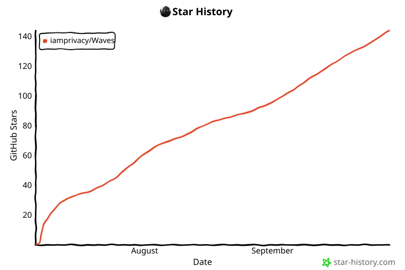

<p align="center">
  
</p>

<p align="center">
  <strong>A native desktop app for saving music from your own TIDAL account for offline listening: search‑first, art‑forward, and built for people who'd rather click than type.</strong>
</p>

<!-- The badges live on ONE source line on purpose: GitHub joins the split
     lines into a row, but other renderers (the mirror frontends among them)
     treat each source line as its own line and stack the badges vertically. -->
<p align="center">
  <a href="LICENSE"></a> <a href="#install"></a> <a href="#install"></a>
</p>

<p align="center">
  
  <br>
  <em>Browse new arrivals and save any track for offline listening in one click.</em>
</p>

<p align="center">
  
  <br>
  <em>Search anything, preview an artist in place, and save a whole discography for offline listening.</em>
</p>

Waves is a from‑scratch, native desktop app for macOS, Windows, and Linux (Intel/AMD and Apple‑silicon/ARM). Its download engine descends from the proven Tidal‑DL‑NG project (continued by the community as [**Tidaler**](https://github.com/maya-doshi/tidaler)) and is maintained and improved here; see [Standing on the shoulders of others](#standing-on-the-shoulders-of-others) for the full lineage.

> A paid TIDAL plan is required. Waves saves from **your own** account, for your personal, non‑commercial use, and can only save what your account can play, up to HiRes Lossless / TIDAL MAX (24‑bit, 192 kHz) and Dolby Atmos where available.

## What Waves can do

- Search all of TIDAL from a single bar, or paste a link to open a release instantly.
- Browse artist and album pages rich with cover art, quality badges, and dates you can sort and filter.
- Preview a full track (or an artist's top song) right inside the app before you save it.
- Save a track, an album, a playlist, a mix, a music video, or an artist's whole discography for offline listening, in one click.
- Pick exactly what a discography pulls in, and let Waves skip duplicate editions.
- Keep your TIDAL favorites close, however large your library grows.
- Follow everything in flight in a live, grouped queue that says what each one will actually sound like.
- Point Waves at your existing music library and see what you already own, badged right in the search results (new, experimental).
- Write Plex‑friendly tags (ReplayGain volume leveling included), and choose the explicit or clean version.
- Set up FFmpeg with one click, and optionally update Waves from inside the app.
- Run native on macOS, Windows, and Linux, at quality up to HiRes Lossless and Dolby Atmos.

---

## Standing on the shoulders of others

Waves exists because of a chain of people who built and kept alive a tool a lot of us love. None of this is mine alone, and I want that to be the first thing you read, not a footnote.

- **exislow** created Tidal‑DL‑NG, the project everything here descends from. The original repository and account disappeared from GitHub, and as far as I know exislow never returned. The work was, and is, excellent. Thank you.
- After that, members of the community picked it up and kept it running. Some of those forks were taken down too, or wound down over time. Everyone who spent their own hours keeping this alive has my gratitude.
- Today it lives on as **[Tidaler](https://github.com/maya-doshi/tidaler)**, maintained by **[maya-doshi](https://github.com/maya-doshi/)** in their spare time. Waves began as a front end built directly on Tidaler, and its engine descends from Tidaler's (more on that below). Thank you, maya‑doshi, for keeping the lights on.
- And underneath all of it sits **[tidalapi](https://github.com/tamland/python-tidal)**, the Python TIDAL client the rest of the stack is built on: every search, every login and every track goes through it. Tidal‑DL‑NG began by wrapping it, and Tidaler and Waves rest on it still. Thank you to everyone who has built and maintained it.

I'm a sucker for a beautiful graphical interface and tend to avoid the command line, but I seem to be in the minority, so the GUI side of tools like Tidaler doesn't get as much attention as the engine underneath. Waves is my way of giving back in a way that's genuinely useful (and, honestly, scratches my own itch): a polished, native GUI that doesn't touch what already works so well.

**Waves is, and always will be, open source under the same license as Tidal‑DL‑NG and Tidaler** (see [License](#license)).

---

## A new face, and an engine kept sharp

The design rule of Waves: **don't break what works, but never stop improving what can be.** The engine descends from Tidal‑DL‑NG by way of Tidaler, and its foundations still come from there: signing in to TIDAL, the multithreaded, segmented transfer core, and the tagging and settings machinery the rest is built on. Nothing is rewritten for its own sake. But wherever that code met a real problem, Waves changed it, and over time that has added up to a lot: about three quarters of today's engine is new code. The biggest areas:

- **Downloads**: pooled connections instead of a fresh encrypted handshake per segment, stops that land mid‑chunk, an atomic final move so an interrupted download never leaves a half‑written file, and a length repair so strict players read the real duration.
- **Network drives**: a few large writes per track instead of hundreds of tiny ones, with retry, and a busy share is never mistaken for a dead one.
- **Long runs**: pacing that follows its settings, and playlists that skip what TIDAL has taken down, wait out a slow‑down and carry on past one failing song.
- **Editions**: strict ISRC matching, most‑complete‑edition selection and the best of both merge.
- **Your library**: the library scan, the record of what Waves has downloaded and the optional MusicBrainz check are new modules of their own.
- **Names and tags**: file names fitted to each system by bytes, stand‑ins for characters a filesystem refuses, playlist folder trees, ReplayGain, clean album‑artist tags and lyrics from LRCLIB.

Waves itself is a UI package (`waves/waves_ui/`) that _imports_ the engine's objects (`Settings`, `Tidal`, `Download`, search) and presents them through a Qt Quick interface.

To be just as plain about who wrote what: I wrote the interface, the in‑app updater, the managed FFmpeg install, the packaging that ships it all as a signed desktop app, and most of today's engine, which by git blame comes to over nine tenths of the application code in this repository. The rest is the code Tidal‑DL‑NG built and Tidaler carried forward, and it is still the foundation everything here stands on.

---

## What's new in Waves

Everything below is **new in Waves**, layered on top of the Tidal‑DL‑NG engine described above:

- **A from‑scratch native UI**: a calm, dark "console" theme (CRT phosphor‑green) drawn in PySide6 / Qt Quick. No web view, no Electron; one real desktop window.
- **Browse, where Waves opens**: TIDAL's editorial front page (New Arrivals, TIDAL Rising, every genre, mood and decade) and your personalized shelves, art‑first, with Preview and Download on hover all the way down. Leave Waves open for days and every page keeps up with what TIDAL shows now.
- **Built‑in updates** (opt‑in): Waves can check for a newer version at launch and install it from a small in‑app notice (download, verify, restart). Updates are **cryptographically signed**, and the check is off until you turn it on and never sends any of your data (see [Privacy](#privacy)).
- **Search‑first**: a single field searches artists, albums, tracks, videos, playlists, and mixes, or resolves a pasted `tidal.com` link and opens the release automatically. The paste button pastes what you copied and runs the search in the same click.
- **Art‑forward results**: cover art inline, results grouped by type, color‑coded quality badges (HI‑RES / LOSSLESS / HIGH) and release‑date sorting. Albums and playlists unfold in place with per‑track selection, and clicking a quality badge picks the quality for just that album or song.
- **Listen before you save**: play any track as a full preview streamed from your own account, right where you are. Previews start fast, seek from the ring around the cover or the line along the bottom, and a slim now‑playing bar follows you across every view.
- **A built‑in video player**: music videos play inside Waves, with a quality picker (up to 1080p) that switches mid‑stream. Rest the pointer on a thumbnail and a preview plays in place. Save videos one at a time, all of an artist's at once, or alongside a discography, tagged and filed as `Videos/Artist/[Year] Title`.
- **One‑click FFmpeg, with status at a glance**: Waves downloads a trusted, checksum‑verified FFmpeg build for your OS/CPU, no hunting down binaries or editing paths. A color‑coded status light shows where things stand, and anything that would come out degraded without FFmpeg warns you first, with a one‑click path to fix it (see [Acknowledgments](#acknowledgments)).
- **Album & artist as first‑class units**: rich artist pages (bio, discography, EPs & singles, top tracks) with one‑click **save‑the‑whole‑thing** actions. Reissues sit at the date they came out, and anything released in the last two weeks wears a NEW mark.
- **Smart whole‑artist saving**: per‑source toggles (albums, EPs & singles, features, compilations, music videos), keeping the **most complete edition** of each album while preserving genuinely different releases like remasters and live takes. Features and compilations bring only the tracks the artist is actually on.
- **Most complete, highest‑quality albums, automatically**: when one edition has the bonus tracks and another the better quality, saving the album quietly builds a _best of both_: a single album that takes each song at its best. Matching is strict (ISRC first), so nothing is dropped or swapped. On by default, tunable in Settings.
- **A real library layout by default**: saved music lands in `Artist/[Year] Album/Disc-Track. Artist - Title`, the structure Plex reads natively. Paths stay customizable, with a live example as you type and a reference of every token, and names are fitted to what your system allows without mangling Japanese, Cyrillic or emoji titles.
- **Library‑friendly tagging**: a "clean album‑artist" mode (on by default) writes only the primary artist to the album‑artist tag, so Plex won't split multi‑artist albums. ReplayGain tags are written by default too, so supporting players level volume without touching the audio.
- **Real lyrics, saved right**: with lyrics enabled, Waves asks [LRCLIB](https://lrclib.net) (the open community synced‑lyrics database behind LRCGet) first and falls back to TIDAL. Timed lyrics save as `.lrc`, untimed ones as `.txt`.
- **Explicit, clean, or both**: when a release comes in both explicit and clean versions, keep whichever you prefer, or both side by side.
- **Instant navigation**: pages and cover art you've already seen render instantly from a local cache and refresh quietly in the background. Back and Forward land on a finished page with scroll position and expanded albums intact, tabs and Settings reopen where you left them, and a breadcrumb trail jumps back to any step.
- **My TIDAL**: your favorite albums, tracks, artists, videos, playlists and mixes, sortable and smooth at any size, opening on a **Home** tab of your newest additions. Every category has a **Download all**, playlist folders drill in like a file manager and mirror on disk, and any playlist can save the **full albums** its songs come from.
- **Grouped download queue**: Completed / Failed / Stopped / Downloading / Queued sections with live progress and per‑album and per‑artist roll‑ups. Downloads run in the order you queued them, every row shows the quality it asked for and the quality that actually arrived, and RETRY ALL retries every failure in one click.
- **Remembers what you've downloaded**: track and video buttons show DOWNLOADED across sessions, and album, artist and playlist downloads fetch only what's missing. Raise the quality setting later and lower‑quality copies offer DOWNLOAD again. Waves only ever looks in your download folder and your library folder.
- **Knows the library you already have** (new, experimental): point Waves at your music folder (Settings > Library) and albums, artists and tracks you already own wear an IN LIBRARY badge wherever they appear, colour‑coded by the quality you hold. It reads your tags, so it works on a library Waves didn't create, and bulk downloads skip what you have. The scan is off by default, incremental, NAS‑friendly and read‑only.
- **At home on a NAS or network drive**: saving straight to an SMB share is a first‑class path. Finished tracks land in a few large writes, brief hiccups retry on their own, and an unreachable folder gets one clear dialog with Try again instead of a wall of failures. On macOS, a share the system ejected is mounted back automatically.
- **Defense‑in‑depth by default**: helper binaries are verified before they run, FFmpeg against a published SHA‑256 and app updates against an Ed25519 signature that fails closed. Extra defensive input validation is layered in as general hygiene.
- **Privacy‑guarded diagnostics** (opt‑in): a local activity log that scrubs identity information at the moment each line is written, not afterward, so an exported bug report is safe to post publicly. See [Diagnostics](#diagnostics) below.
- **A clean way out, built in**: the bottom of Advanced settings offers "Reset all settings" (you stay signed in) and "Reset application", a factory reset of everything Waves saved on this computer. Both ask first, and neither can touch your music: the reset deletes only from a fixed list of Waves' own files.
- **Silent background work on Windows**: every FFmpeg job (FLAC extraction, video conversion, previews) runs fully hidden. No more split‑second console pop‑ups stealing focus while you type, a long‑standing annoyance in the upstream app.
- **Thoughtful touches**: a cinematic open‑water launch sequence, an ASCII wave logo that weathers the occasional lightning storm, cover art that tilts toward your cursor, a back‑to‑top pill on every page, and a window that reopens at the size and place you left it.

---

## Privacy

**Privacy is the foundation of this application.** Waves collects nothing about you and has no way of knowing how the application is used: no telemetry, no analytics, no tracking. By default it makes no unsolicited outbound connections at all. It talks to TIDAL only to do what you ask. There are four optional, user‑controlled exceptions, and **none of them sends any of your data** (each is a plain request that carries nothing about you):

- Clicking the FFmpeg button downloads a build from the open‑source FFmpeg host, and with FFmpeg's automatic update check on (off by default) Waves asks that host whether a newer build exists, on every launch or at most once a day (your choice in Settings, once a day by default).
- Turning on automatic update checks (off by default) lets Waves ask the public GitHub releases page whether a newer version exists. The check only ever _notifies_ you; nothing downloads until you choose to update.
- With lyrics enabled (off by default), each track you save also asks [LRCLIB](https://lrclib.net), an open community lyrics database, for that track's lyrics. The request carries only the track's artist, title, album and length, never anything about you or your account, and the "Prefer LRCLIB lyrics" switch in Settings turns it off.
- With the library scan's MusicBrainz check on (off by default), an album the scan cannot settle on its own is asked about at [MusicBrainz](https://musicbrainz.org), the open music encyclopedia. The request carries only that artist and album title, never anything about you or your account; requests go out at most one per second, and answers are cached locally.

Your credentials and your saved music stay on your machine, and on macOS and Linux the files Waves keeps for itself (your settings, your sign‑in, its caches and logs) live in a folder only your account can open, not every account on the machine. The same principle carries into the optional diagnostic logger below: nothing leaves your machine unless you export a report yourself.

---

## Diagnostics

Most apps make a bug report cost you your privacy: either describe the problem badly, or hand over a raw log full of your username, file paths, and account details. Waves closes that gap by redacting at the source. Identity information never reaches the log in the first place, so there is nothing to leak, whether you export a report or not.

- **Off by default.** Only warnings and errors are kept until you ask for more. In **Settings → Diagnostics**, turn on **Verbose diagnostics**, reproduce the problem, then click **Export report** for one text file ready to attach to an issue.
- **Redacted at the source, not the export.** Every log handler shares the same filter: usernames, file paths (every OS's forms), hostnames, IP/MAC addresses, emails, session tokens, and your TIDAL account id are replaced with placeholders the instant they would otherwise be written, verbose mode or not. The one exception is a native crash or freeze dump, which the system's fault handler writes straight into `crash.log`; **Export report** redacts that too, so attach the report rather than the raw file.
- **A breadcrumb trail, always on.** Waves keeps the last ~250 activity events in memory at no disk cost. The moment something goes wrong, that trail is written to the log automatically, so even a first-time crash arrives with the events that led up to it.
- **An optional second layer.** "Also hide titles and searches" additionally hashes what you searched for and any track, album, or artist names in the export, for anyone who'd rather not share that either.

The log lives at `waves_dev.log`, next to `crash.log`, in the Waves config folder (`~/Library/Application Support/Waves` on macOS, `%APPDATA%\Waves` on Windows, `~/.config/Waves` on Linux). It's plain text; read it yourself any time you like. Clicking **Export report** doesn't send anything anywhere: it writes a separate, timestamped copy of that redacted data into the same folder, and **Show file** opens it in your file manager so you can move it, attach it, or send it yourself, wherever you want.

**Logs are never transmitted off your device, unless you do it yourself.**

---

## Requirements

- A **paid TIDAL plan** and a one‑time sign‑in (Waves walks you through the browser login on first launch and reuses the cached token afterwards).
- On macOS: **macOS 12 Monterey or newer**, on Intel and Apple silicon alike. The regular macOS builds need **macOS 15 Sequoia**; on Monterey through Sonoma, grab the `legacy` build instead (same app, an older bundled Qt). Homebrew and the in‑app updater pick the right one for your machine automatically.
- On Linux: **glibc 2.35 or newer** (Ubuntu 22.04, Debian 12, Fedora 36 or anything newer), on x64 and ARM64.
- Python 3.12 or 3.13 (if running from source).
- FFmpeg is used for in‑app previews and a few conversions (e.g. some video / hi‑res cases). Waves can install it for you with one click (see above).

---

## Install

Grab the build for your platform from the [**latest release**](../../releases/latest):

| OS                  | Intel / AMD (x64)              | ARM (Apple silicon, etc.)              |
| ------------------- | ------------------------------ | -------------------------------------- |
| macOS 15+           | `waves_macos-intel.zip`        | `waves_macos-apple-silicon.zip`        |
| macOS 12 through 14 | `waves_macos-intel_legacy.zip` | `waves_macos-apple-silicon_legacy.zip` |
| Windows             | `waves_windows-x64.zip`        | `waves_windows-arm64.zip`              |
| Linux               | `waves_linux-x64.zip`          | `waves_linux-arm64.zip`                |

Unzip and run: on macOS drag `waves.app` to Applications (first launch needs a one‑time approval in System Settings, see the note below); on Windows and Linux run `Waves` from the unzipped folder. Every asset ships with a SHA‑256 checksum, and the release carries a signed `SHA256SUMS` manifest; the expected hash of every asset is printed on the release page, and [Verify a download](#verify-a-download) has the copyable steps.

**macOS via Homebrew:**

```bash
brew tap iamprivacy/waves
brew install --cask waves
```

Waves then knows it's Homebrew‑managed: the in‑app "Update & restart" button runs `brew upgrade` for you instead of downloading a new build itself.

**Linux via AppImage:** download `waves_linux-x64.AppImage` (or `-arm64`) from the release, mark it executable (`chmod +x`), and run it directly, no unzip, no install step. The in‑app updater keeps it current in place.

Prefer to run from source?

```bash
# from a clone of this repository
python -m venv .venv && source .venv/bin/activate   # Windows: .venv\Scripts\activate
pip install -e ".[gui]"     # the [gui] extra pulls in PySide6 / Qt
python -m waves.waves_ui
```

Waves is GUI‑first and does not ship a command‑line interface. If you prefer the command line, use the upstream **[Tidaler](https://github.com/maya-doshi/tidaler)** project directly; it provides a maintained, CLI‑focused build (`tidaler` / `tdn`) of the same engine Waves is built on.

> **A note on macOS Gatekeeper:** the builds are not yet Apple‑notarized, so macOS quarantines a freshly downloaded `waves.app`. On first launch macOS shows a warning with no way to proceed; click **Done**, then go to **System Settings → Privacy & Security**, scroll down, and click **Open Anyway** next to the Waves entry. Confirm once and macOS remembers the choice from then on. (The old right‑click → Open shortcut no longer works on macOS 15 Sequoia and later.)
>
> **A note on Windows SmartScreen:** the builds are not yet code‑signed, so the first launch may show a Microsoft Defender SmartScreen prompt ("Windows protected your PC"). Click **More info**, then **Run anyway**. SmartScreen is a reputation check on new, unsigned software, not a malware detection; it fades on its own as a release accumulates clean installs.

## Verify a download

Optional, for anyone who wants to check a download before the first launch. Every release carries two small files next to the builds: `SHA256SUMS`, one line per asset with its SHA‑256, and `SHA256SUMS.sig`, an Ed25519 signature over that file made with the Waves release key. The release page also prints each asset's hash in its **Verify** section. The public half of the release key, compiled into every build and checked by the in‑app updater before it installs anything:

```
-----BEGIN PUBLIC KEY-----
MCowBQYDK2VwAyEAcetggrhiqyMN5HsBCi/f2gJL75FVPOYGU/sd4dI5b+0=
-----END PUBLIC KEY-----
```

**macOS or Linux**, from a folder holding the zip, `SHA256SUMS` and `SHA256SUMS.sig`. The signature step needs OpenSSL 3: most current Linux distributions ship it, and on macOS the built-in `openssl` is LibreSSL, which cannot check it, so install OpenSSL 3 with `brew install openssl@3` and run the third command with `$(brew --prefix openssl@3)/bin/openssl` in place of `openssl`:

```bash
printf '%s\n' '-----BEGIN PUBLIC KEY-----' 'MCowBQYDK2VwAyEAcetggrhiqyMN5HsBCi/f2gJL75FVPOYGU/sd4dI5b+0=' '-----END PUBLIC KEY-----' > waves-release.pem
base64 --decode < SHA256SUMS.sig > SHA256SUMS.sig.bin
openssl pkeyutl -verify -pubin -inkey waves-release.pem -rawin -in SHA256SUMS -sigfile SHA256SUMS.sig.bin
grep -v '^#' SHA256SUMS | tr -d '\r' | shasum -a 256 --ignore-missing -c -
```

The third command must print `Signature Verified Successfully` and the last one `<asset>: OK` for the zip you downloaded (on a system without `shasum`, use `sha256sum` in its place). Any other output means the file does not match this release: delete it and download again.

**Windows** (PowerShell), from the same folder, with `waves_windows-x64.zip` replaced by the zip you downloaded:

```powershell
(Get-FileHash .\waves_windows-x64.zip -Algorithm SHA256).Hash.ToLower()
Select-String -Path SHA256SUMS -Pattern waves_windows-x64.zip
```

The two hashes must be identical. To also check the signature on Windows, run the macOS/Linux commands in Git Bash, which ships OpenSSL.

**Waves is open source, and that means you can check the code for yourself. If reading the source is not something you are capable of doing, you can upload the downloaded zip to [VirusTotal](https://www.virustotal.com) and have it checked for viruses before you even extract it. Your privacy and security are important to me. Trust, but verify.**

---

## A note from the author

Waves is the first piece of software I've ever released. I've spent a couple of decades in and out of tech, most of it on the other side of the fence, beta‑testing, filing bug reports, and helping developers polish their games and software. Building something and putting my own name on it is new to me, and so is everything that comes after a release: the maintaining, the issue‑tracking, the keeping‑the‑lights‑on side of running a project. This is a side project built in spare time, so I won't always be fast, and I'm certain I'll get some things wrong as I learn the developer's half of all this.

None of that changes the welcome. If something breaks, behaves oddly, or just feels off, please open an issue, however small, and I'll genuinely read it and do my best to reply. Giving feedback is the thing I know how to do best, and I'm grateful to now be on the receiving end of it. Thank you for trying Waves.

---

## Star History

<!-- star-history:start -->
<picture>
  <source media="(prefers-color-scheme: dark)" srcset="assets/star-history/star-history-dark.svg">
  
</picture>
<!-- star-history:end -->

---

## Acknowledgments

Waves is only possible because of a lot of excellent open‑source work.

**The project Waves descends from**

- [**Tidaler**](https://github.com/maya-doshi/tidaler) by [maya-doshi](https://github.com/maya-doshi/), the project Waves' engine descends from.
- **Tidal‑DL‑NG** by exislow (where it all started), and everyone who maintained it in between.

**Core libraries** (all credit to their authors and maintainers)

- [tidalapi](https://github.com/tamland/python-tidal): the TIDAL API client at the heart of the engine
- [PySide6 / Qt for Python](https://doc.qt.io/qtforpython/): the GUI toolkit Waves is drawn with
- [mutagen](https://github.com/quodlibet/mutagen): audio metadata tagging
- [python‑ffmpeg](https://github.com/jonghwanhyeon/python-ffmpeg), [m3u8](https://github.com/globocom/m3u8), [pycryptodome](https://github.com/Legrandin/pycryptodome): streaming, playlist parsing, update signature verification
- [requests](https://github.com/psf/requests), [dataclasses‑json](https://github.com/lidatong/dataclasses-json), [pathvalidate](https://github.com/thombashi/pathvalidate)
- [Rich](https://github.com/Textualize/rich), [Typer](https://github.com/fastapi/typer), [coloredlogs](https://github.com/xolox/python-coloredlogs): used by the inherited CLI

**FFmpeg**

- [**FFmpeg**](https://ffmpeg.org) © the FFmpeg project, the tool itself.
- The one‑click installer downloads (never redistributes) prebuilt static binaries from:
  - **macOS & Linux** (all architectures) → [**ffmpeg.martin-riedl.de**](https://ffmpeg.martin-riedl.de) ([build scripts](https://git.martin-riedl.de/ffmpeg/build-script)): native per‑architecture builds; the macOS builds are signed & notarized. Thank you, Martin Riedl.
  - **Windows** → [**BtbN/FFmpeg‑Builds**](https://github.com/BtbN/FFmpeg-Builds). Thank you, BtbN.

**Lyrics**

- [**LRCLIB**](https://lrclib.net): the open, community‑driven synced‑lyrics database Waves asks first, run free of charge, with no key and no strings attached. Thanks to everyone who contributes lyrics to it.
- [**LRCGet**](https://github.com/tranxuanthang/lrcget) by [**tranxuanthang**](https://github.com/tranxuanthang), who built both LRCGet and LRCLIB itself and keeps the service running for everyone. Waves' lyrics support follows the path LRCGet paved. Thank you.

**Type**

- [JetBrains Mono](https://www.jetbrains.com/lp/mono/) is bundled for the interface, under the [SIL Open Font License](waves/waves_ui/fonts/OFL.txt).

**Icons**

- [Phosphor Icons](https://phosphoricons.com): the interface glyphs (play, pause, download, search, and the rest) are bundled from Phosphor, under the [MIT License](waves/waves_ui/qml/PHOSPHOR-LICENSE.txt).

If I've missed anyone, it's an oversight, not an intent. Please open an issue and I'll fix the credit.

---

## License

Waves is licensed under the **GNU Affero General Public License v3.0 (AGPL‑3.0)**, the same license as Tidal‑DL‑NG and Tidaler. See [LICENSE](LICENSE) for the full text. Because Waves is a derivative work, it stays AGPL‑3.0, and so must anything built on it.

Copyright (C) 2026 iamprivacy. Waves is free software: you can redistribute it and/or modify it under the terms of the AGPL‑3.0.

---

## Disclaimer

Waves is an independent project and is **not affiliated with, endorsed by, or sponsored by TIDAL**. TIDAL is a trademark of its owner, used here only to identify the service Waves works with.

Waves is a personal, non-commercial tool for **your own** TIDAL account, using your own credentials. It can only save what your account can already play: it cannot reach anything the account cannot reach, it does not remove or bypass any encryption or copy protection, and it is not a way around a subscription. If TIDAL will not serve a stream to your account, Waves cannot save it.

You are solely responsible for how you use it. Do not use it to infringe copyright or to reproduce, distribute, or pirate content. **Your use may violate TIDAL's Terms of Service, and you accept that risk**, including any consequences to your account.

The software is provided "as is", without warranty of any kind, and to the fullest extent permitted by law its developers and contributors accept no liability for any damages arising from it. See sections 15 and 16 of the [AGPL-3.0](LICENSE). By using Waves you agree to indemnify and hold harmless its developers and contributors against any claim arising from your use of it or your breach of these terms.

Waves collects no information and its developer has **no way of knowing how the application is used**. That is a deliberate privacy design, not an excuse: anyone using Waves to infringe copyright does so in breach of these terms and without the developer's knowledge or consent.

Full terms: **<https://getwaves.dev/terms/>**. Questions reach the project through [GitHub issues](https://github.com/iamprivacy/Waves/issues).

Please respect the artists and rights-holders whose work this plays.
