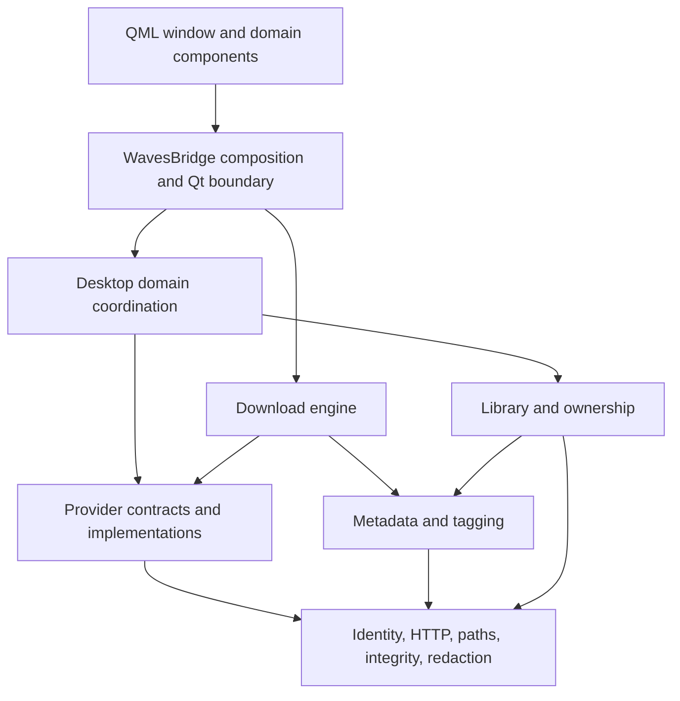

# Architecture and domain ownership

Use this map to find a feature's implementation, UI, tests and rules. Start
with [CONTEXT.md](../CONTEXT.md) for domain vocabulary and
[DEVELOPER.md](../DEVELOPER.md) for setup and commands. The
[documentation index](README.md) points to specifications and ADRs.

## Runtime boundaries



- QML calls the `waves` context object's slots and consumes plain payloads
  through Qt signals. SDK objects remain in Python. The bridge reference is
  [BRIDGE.md](../waves/desktop/BRIDGE.md).
- `desktop/backend.py` constructs sessions, pools, timers, relays and domain
  state. `QueueMixin` and `LibraryMixin` operate on that state; they never
  import the backend. `JobRuntime` owns per-job registries by composition.
- Settings schema construction and provider presentation take explicit
  values/callbacks. They have no bridge or Qt imports. Schema reads are
  per-call snapshots; apply/save lifecycle remains bridge-owned.
- The engine, providers, library and metadata never import `desktop` or Qt.
  Provider-neutral operations use `providers/base.py`; SDK exceptions,
  catalog mapping and download adapters belong to the provider. The
  inherited TIDAL engine still has TIDAL-specific resolution; it is not a
  universal engine, and Apple uses its own adapter.
- Infrastructure modules have specific contracts: `ids.py` for identity,
  `http.py` for pooled sessions, `file_integrity.py` for streaming SHA-256,
  `redaction.py` for privacy, and `events.py` for typed redacted application events. Do not borrow another domain's private
  helpers for these operations.

This map names the current implementation, including subordinate engine contracts
and captured queued intent. Remaining accepted extensions follow:
[Provider → Engine → Runtime](adr/0010-provider-engine-runtime-boundary.md),
[captured fulfillment intent and catalog offers](adr/0011-captured-fulfillment-intent.md),
[composable surfaces/Settings](adr/0012-composable-provider-surfaces.md), and the notification-center consumer of
[structured redacted events](adr/0013-redacted-event-lifecycle.md). Add those
contracts within their existing provider, download, metadata and desktop owners;
do not infer new implemented folders or a global manager from the target design.
Capability release requires packaged/native, account/runtime and delivered-media
qualification, not merely building this dependency graph.

Product contracts and coherent UI slices are upstream candidates. This fork's
CI/graph/branch workflow and image publishing remain independent; an upstream
integration does not require the fork image. Maintained docs own contracts;
research, benchmarks and delivery evidence belong in issues/PRs and releases.

## Find a feature

Python owner paths below are relative to `waves/`; test paths are relative to
the repository root. The QML column is relative to `waves/desktop/qml/`. A
backend method family is listed
where coordination remains central; a directory does not imply that all its
behavior has been extracted.

| Domain                                    | Python owners / entry points                                                                                                                                                                                                                                                              | QML under `waves/desktop/qml/`                          | Tests / durable rules                                                               |
| ----------------------------------------- | ----------------------------------------------------------------------------------------------------------------------------------------------------------------------------------------------------------------------------------------------------------------------------------------- | ------------------------------------------------------- | ----------------------------------------------------------------------------------- |
| Search and pasted links                   | `desktop/backend.py`: `search`, search result/cache builders, link resolution; provider catalog methods                                                                                                                                                                                   | `domains/search/`; results/routing in `Main.qml`        | `tests/search/`, `tests/providers/`; provider spec and ADR-0008                     |
| Browse / discovery                        | backend browse/page/cache families; provider browse methods                                                                                                                                                                                                                               | `domains/browse/`; page composition in Main             | `tests/browse/`; ADR-0008                                                           |
| Artists, albums, playlists, mixes, videos | backend catalog/page/edition families; `providers/tidal.py`, `providers/apple/provider.py`; edition/presence rules in `metadata/matching.py`; catalog identity in `metadata/catalog_identity.py`, provider-owned `catalog_identity` adapters, and `desktop/providers/catalog_identity.py` | `domains/catalog/`; video overlay in Main               | `tests/catalog/`, `tests/metadata/`, `tests/providers/`                             |
| Preview / playback                        | backend preview resolve/probe families, one shared player in Main                                                                                                                                                                                                                         | `domains/playback/`                                     | `tests/playback/`; BRIDGE preview contract                                          |
| Download execution / Chooser              | `download.py`, `model/downloader.py`, `progress.py`, `poolgauge.py`, `playlists.py`; Apple `providers/apple/runner.py`; backend job construction and Chooser slots                                                                                                                        | `domains/downloads/`, reused by catalog and queue       | `tests/downloads/`, `tests/providers/`; ADR-0001/0002, provider spec                |
| Queue                                     | `desktop/queue/bridge.py` row transitions/publication, `runtime.py` job registries, `progress.py` Qt progress carriers; backend pump/refetch/scheduling                                                                                                                                   | `domains/queue/`                                        | `tests/queue/`; BRIDGE queue and threading contracts                                |
| Library / ownership / My Music            | `library/index.py`, `ownership.py`, recovery/mount helpers and `worker.py`; `desktop/library/bridge.py` presence/scans/files, `scan_process.py` child lifecycle; backend saved shelves/folders                                                                                            | `domains/library/`                                      | `tests/library/`, provider saved-shelf tests; ADR-0003/0007                         |
| Providers / authentication / session      | `providers/base.py`; `tidal.py`, `tidal_client.py`, `tidal_folders.py`, `tidal_manifest.py`, `tidal_refusals.py`; `apple/`; `desktop/session.py`; backend session lifecycle; `desktop/providers/presentation.py` payload builders                                                         | `domains/providers/`; provider settings in SettingsPage | `tests/providers/` with `tidal/` and `apple/`; provider spec and ADR-0004/0006/0008 |
| Settings / preferences                    | `model/cfg.py` persisted fields, `model/download_policy.py` rules and immutable intent, `config.py` loading/migration/session; `desktop/settings/schema.py` labels/defaults/schema/coercion registries, `persistence.py` atomic/coalesced writers; backend apply/side effects             | `domains/settings/`                                     | `tests/settings/`; ADR-0001 and provider spec                                       |
| Diagnostics                               | `events.py` typed events, `desktop/diagnostics/events.py` queued delivery/actions, `desktop/diagnostics/export.py` breadcrumb/crash/export, `devlog.py` opt-in timing, `redaction.py` shared privacy                                                                                      | `domains/diagnostics/`                                  | `tests/diagnostics/`                                                                |
| Updates                                   | `desktop/updates/updater.py`, `signing.py`; `desktop/runtime_paths.py` shared frozen/source launch identity                                                                                                                                                                               | settings and shell restart surfaces                     | `tests/updates/`, signing tools and packaging guards                                |
| FFmpeg provisioning                       | `desktop/ffmpeg/manager.py`; engine FFmpeg use stays beside the download behavior                                                                                                                                                                                                         | `domains/ffmpeg/`                                       | `tests/ffmpeg/`, `tests/downloads/`                                                 |
| Metadata / tagging                        | `metadata/tags.py`, `matching.py`, `naming.py`, lyrics/TTML, MusicBrainz arbiter, Camelot; path templates in `paths.py`                                                                                                                                                                   | Settings and catalog consumers                          | `tests/metadata/`, relevant library/download tests                                  |
| Application shell / shared UI             | `desktop/app.py`, `__main__.py`, `worker.py`, `proc.py`; backend window/preferences integration                                                                                                                                                                                           | `Main.qml`, `shell/`, `components/`, `primitives/`      | `tests/ui/`; DEVELOPER threading/boot rules                                         |
| Distribution / tooling                    | `tools/`, `packaging/`, `mise.toml`, `.github/`                                                                                                                                                                                                                                           | resources included recursively                          | `tests/packaging/`; platform/distribution ADRs and evidence                         |

## Directory rules

```text
waves/
  library/                    scan, files, ownership, recovery, child worker
  metadata/                   tags, matching, naming, lyrics
  providers/                  contract + TIDAL modules + apple/ adapter
  model/                      engine/configuration data contracts
  desktop/
    backend.py                context object and remaining coordination
    app.py, session.py        process/window and tracked session lifecycle
    library/                  bridge family and scan process controller
    queue/                    bridge family, runtime and progress carriers
    settings/                 schema vocabulary and persistence
    providers/                presentation shared by settings/live surfaces
    diagnostics/, updates/, ffmpeg/
    qml/
      Main.qml                window/routing/composition entry point
      domains/                search, browse, catalog, playback, downloads,
                              queue, library, providers, settings,
                              diagnostics, ffmpeg
      shell/                  navigation and window branding
      components/             reusable composite UI concepts
      primitives/             low-level controls, Icon, Palette, qmldir
      assets/                 root-relative runtime assets
    icons/, fonts/            packaged assets with licenses
tests/
  <domain>/                   behavior tests and domain-specific fakes
  providers/{tidal,apple}/    provider-specific contracts
  ui/                         shell and shared QML behavior
  packaging/                  build/CI/resource contracts
  support/                    shared Qt, offline, paths and audio harnesses
  account/                    opt-in live-account checks
```

A domain-only component belongs in its domain. Shared composites use
`components/`; low-level controls use `primitives/`. Domain components may
compose other domain controls with explicit relative imports (for example a
catalog row's download button). Primitives and shared components must not
import domains. Dialogs stay with the domain whose decision they implement;
there is no generic global dialog folder. Main composes domains, shell and
shared UI, and remains responsible for shared window state.

Resolve resources relative to their owning file. `ProviderLogo` resolves
descriptor logo paths from the QML root, so moving a consumer cannot change
their meaning. Keep QML file names unique across directories to make type
references and searches unambiguous; update imports and inline test harnesses
when a type moves. The build recipes include the entire QML tree.

## Public contracts and naming

- Python modules/functions/properties use `snake_case`, classes use
  `PascalCase`, constants use `UPPER_SNAKE_CASE`. Files describe their owner
  and operation: `settings/schema.py`, `library/scan_process.py`,
  `updates/signing.py`. Avoid generic shared/helper/manager folders.
- Qt slots/signals/properties retain `camelCase` because QML consumes that
  ABI. Internal Python helpers use snake case. Do not rename serialized
  settings or payload keys as part of an internal cleanup.
- QML component files use `PascalCase`; IDs, functions and properties use
  `camelCase`. Use concept names such as `QualityPicker`, `QualityBadge`,
  `SearchField`, `MusicList`, `SavedPlaylistRow`, `Icon`, `ActionButton`.
- Use the glossary's Provider, Engine, Edition, Version, Ownership and
  Chooser meanings. Album/track/video describe distinct catalog kinds;
  `media` is appropriate only for code accepting several kinds. Library
  means scanned files; provider saved shelves are separate sources in My Music.
- A payload's `id` is its primary media identity; `album_id` or `artist_id`
  names a relation. `provider_id` names a provider; `qid` is the established
  integer queue-job key. Media IDs are namespaced strings; legacy bare IDs
  read as TIDAL. Identity/source-stream IDs remain distinct during merges.
- Import public helpers from their owner (`ids`, `http`, `file_integrity`,
  settings schema/persistence, provider presentation, runtime paths).
  Underscored names are implementation details. Existing mixins share bridge
  state and private coordination methods intentionally; do not treat these
  as general APIs for new domains. Their remaining coupling is documented in
  their module docstrings. `bridge_surfaces.py` retains legacy payload helpers
  and backend monkeypatch targets until each call site can move coherently.
- Name behavior tests `test_<behavior>.py`, use unique basenames across the
  suite (pytest's current import mode requires them), and put fixtures beside
  their domain. Only widely used harnesses belong in `tests/support/`.

## Working and validation

1. Read this map and the domain's rules, narrow with the code-review graph,
   then read implementation and tests. Graph emptiness is not evidence of
   absence; dynamic Python and QML relationships need source verification.
2. Run a domain suite through `uv run --locked --all-extras pytest
tests/<domain>/`. Markers describe execution requirements, independent of
   folder: `qml`, `ffmpeg`, `slow`, `integration`, `account`.
3. Use `mise run format`, then `mise run check` (`lint` aliases that gate),
   and `mise run test-strict` alone for integrated changes. Local development
   and manual CI use the same underlying tasks. `check`'s format hooks can
   rewrite files; validate the final formatted tree.
4. Moves must update source imports, QML imports/assets, test harnesses,
   resource recipes, dynamic module names, CI/tool imports and documentation.
   Wheel inspection and strict offscreen/process tests prove source/resource
   wiring; native bundle signatures and live-service behavior need their own
   evidence.

Main and the bridge still coordinate several domains. Extract only a stable
state owner or independently testable rule, preserving Qt affinity,
generation guards and lifecycle sequencing. Do not split them into arbitrary
file sections or add forwarding interfaces to make the diagram look tidier.
