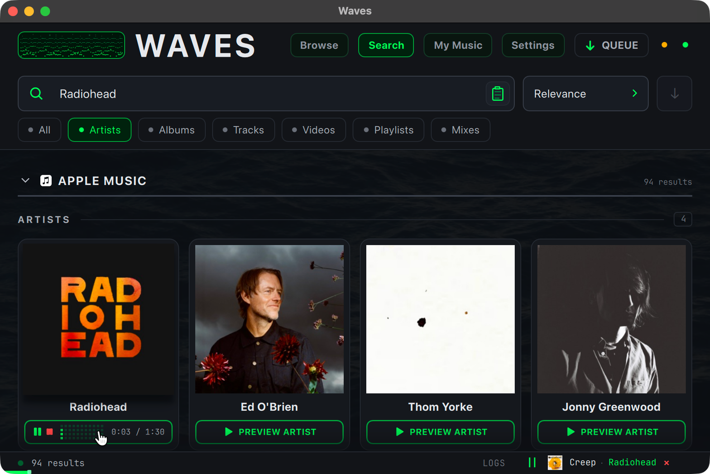
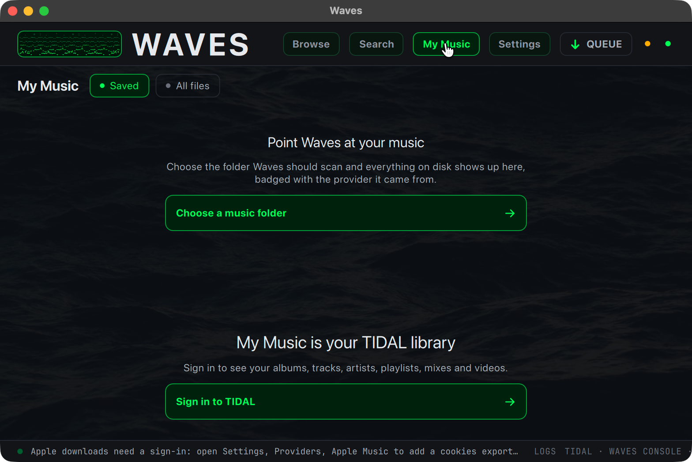

# Native UI audit — 2026-09-30

Issue: [#556](https://github.com/ranokay/waves/issues/556). The audit preserves Waves' dark CRT identity and makes bounded corrections to existing controls and navigation.

## Corrections

- **Layout and positioning:** provider setup links follow the correct provider band as lazy controls finish sizing. Keyboard focus scrolls into view through nested vertical and horizontal panes. Pointer, keyboard, scrolling and disclosure actions take ownership from delayed Settings restoration. Album/playlist selection targets are 28 px with the existing 18 px indicator.
- **Hierarchy and typography:** one shared dim-text token replaces copies across related components, raising regular secondary-text contrast from approximately 3.53:1 to 5.14:1 on the primary card surface. Empty queues no longer advertise CLEAR ALL; failed rows expose their full reason. Artist credits filter missing names and preserve separators and full tooltips.
- **Shared components:** preview seeking uses one PreviewSeekArea for the footer, preview bar and track control. Existing TapAction handles keyboard activation, focus and accessible names across equivalent actions. Artwork and title links share eligibility while keeping one ordinary Tab stop for the same navigation action.
- **Navigation and search:** Apple album/playlist detail, refresh and prefetch work without a TIDAL session, while provider capability and enabled-state gates stay in the backend. Shared detail loading/error/empty states apply to either provider. Filters with no matching category show a count-aware explanation. Apple enable state follows live status.
- **Keyboard and accessibility:** named actions cover Settings sections/flags, artwork/cards, artist/album links, library controls, expansion, downloads, preview controls and standalone lyrics/cover actions. macOS uses Qt's all-controls Tab policy. Collapsed Settings controls and completely clipped artist links leave the Tab chain. Selection checkboxes name their track/release. Seek sliders expose values and support arrows, Home and End.
- **QML cost:** folded artist top tracks instantiate five delegates instead of all 242 records in the inspected artist. The complete model remains available when expanded. Scrubbing updates visual position during a drag and commits one seek on release. Focus revelation runs on focus changes, rather than continuously.

## Coverage and limits

| Surface                  | Native macOS interaction                                                                                        | Additional rendered/scenario coverage                                                                    |
| ------------------------ | --------------------------------------------------------------------------------------------------------------- | -------------------------------------------------------------------------------------------------------- |
| First run/provider setup | Signed-out Browse and provider setup/download gates                                                             | Clean onboarding at minimum/default sizes                                                                |
| Search                   | Apple searches, all category filters, 94/95-result sets, long artist/title content, sort and quality menus      | Category empty state and provider gates                                                                  |
| Artist/release/playlist  | Real Apple artist, album and playlist; open/back/history, expansion, hover, preview play/pause/stop and seeking | Folded/expanded tracks, accountless catalog scenarios                                                    |
| Browse/library           | Signed-out Browse, My Music empty states and navigation                                                         | Existing Browse/library scenarios and control semantics                                                  |
| Queue                    | Empty drawer, close/Escape, minimum size                                                                        | Queued, downloading, completed, failed and cancelled; long labels, collapsed groups and failure tooltips |
| Settings                 | Every section, including Providers/Advanced; collapse, focus, popup Escape, deep links                          | Every section rendered; live enable state, scroll restoration and focus after viewport remeasure         |
| Shared controls          | Pointer hover/press, keyboard Tab/Shift+Tab, Enter/Space, preview and download paths                            | Accessibility names, values, disabled/collapsed state and activation scenarios                           |

The real source application was launched with `mise run app`. Later clean launches used the same source entry point through an isolated native app wrapper. Window checks included the actual minimum (880×560 on this screen), default (1040×780), intermediate/large desktop geometry and native maximization. Native Retina rendering was observed; independent display scaling settings were not changed. Final clean-launch interaction rechecked provider positioning, visible keyboard targets, queue dismissal, library navigation and preview/download paths at the minimum size.

No TIDAL credentials were available. Populated TIDAL Browse/library/mixes/videos, video hover playback and real authenticated downloads/simultaneous queue activity remain live-account gates. Offscreen queue scenarios do not establish real network throughput or frame pacing. Windows/Linux chrome, other aspect ratios beyond those observed, multi-display placement and independent scaling variants remain platform gates. The native first-run flag persisted outside the isolated XDG profile, so clean onboarding was inspected through isolated Qt rendering.

## Intentional non-changes and human judgement

The artwork tilt/lift/shadow treatment, hover-video design, CRT backdrop, accent meanings, card proportions and broad typography hierarchy remain intact. No observed defect justified a subjective redesign. Fixed-width artist shelves and distant right-aligned actions on very wide rows remain candidates for human design judgement; changing them would alter the art-forward grammar. Long credits use clipping/elision plus full tooltips and skip fully clipped keyboard targets; no width-specific column hacks were added.

No measured frame-time result is claimed. Native accessibility traversal occasionally timed out on a large result set; the rendered application remained interactive, so this is recorded separately from app scrolling performance. Existing QML/type-check warnings remain outside the bounded fixes; final command exits/counts are recorded in the PR.

## Review record

OpenCodeReview returned a **partial** review: 25 comments, with 18 of 29 selected items failing to complete. All returned comments were resolved: stale palette/interaction comments, playlist expansion parity, equivalent title/card gates, Browse section/link/preview/download keyboard paths, empty-title fallbacks, undecorated section names and artist-credit separators. Duplicate comments are included in the count. The complete committed diff and subsequent fix deltas received separate Standards and Spec reviews.

- **Standards:** provider gating, accessible disclosure labels, inert album focus, stable preview identifiers, credit consistency, delayed scroll ownership and rendered-behavior test assertions were corrected. Final review has no open findings.
- **Spec:** download keyboard access, clipped credit focus, credit punctuation and disclosure naming were corrected. Final review has no open findings.

The PR records the final frozen SHA and `mise run check` / `mise run test-strict` exits and counts. Native screenshots below are captures from the audit walkthrough, not substitutes for those gates or claims of account-dependent coverage.

## Native captures

Artist search preview, showing real fonts, artwork and playing state:

My Music at the minimum desktop window size:

